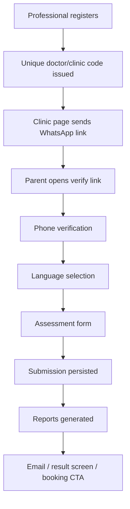
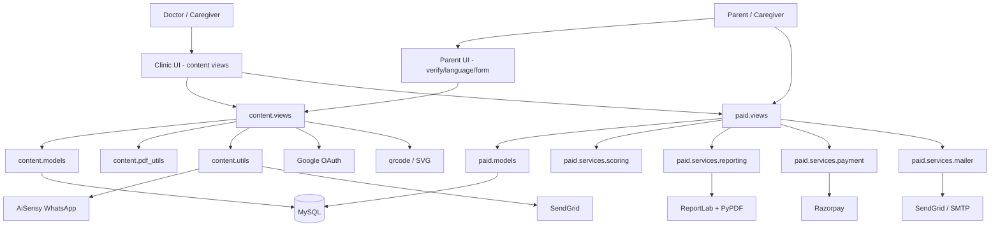
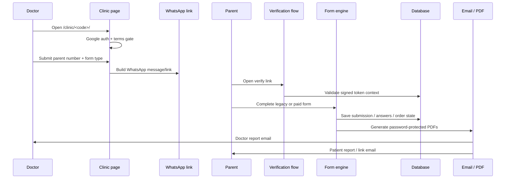
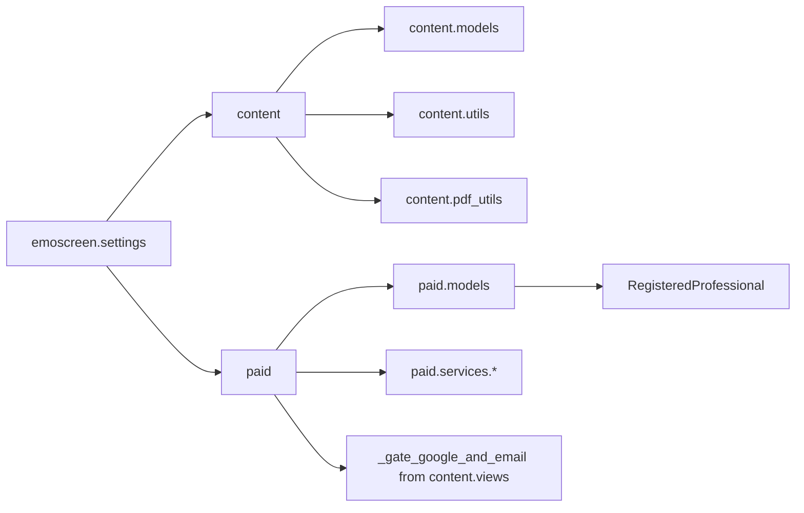
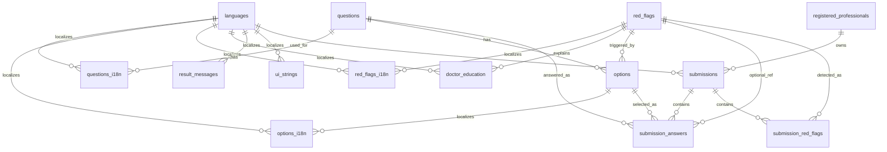
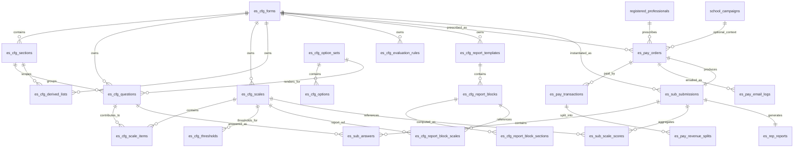
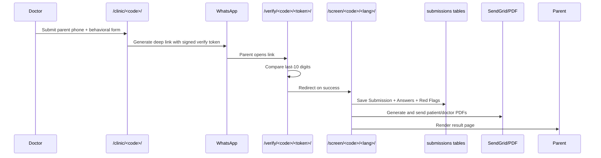
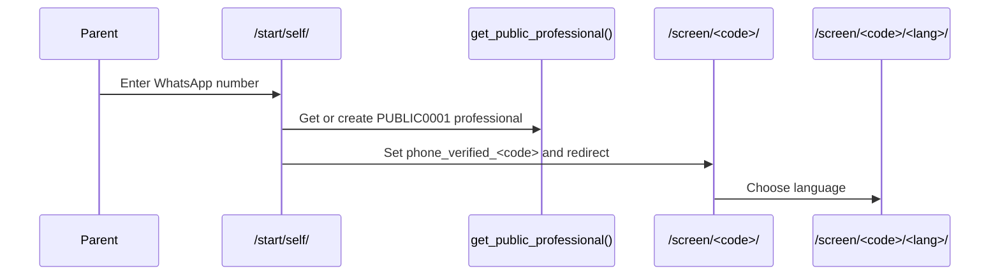
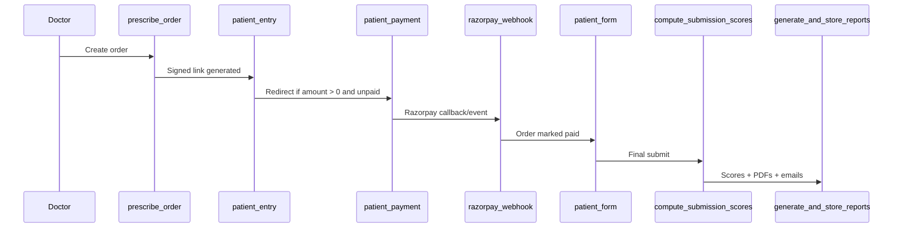

# EmoScreen README

## Scope

This document is derived **only** from the provided repository export (`EmoscreenCode.txt`) and database export (`emoscreenlocal.sql`). The code and schema together show a Django/MySQL system with two primary product surfaces: a **legacy Behavioral and Emotional Red Flags screening flow** implemented in the `content` app, and a **newer paid, configurable EmoScreen assessment flow** implemented in the `paid` app. The project root mounts both apps at the same site root and also enables Google OAuth via `social_django`.

A schema-level caveat is visible in the SQL dump: `es_pay_orders` optionally references `school_campaigns`, and the migration history includes a `schools` app, but the provided code export only exposes `content`, `paid`, and `social_django` as installed application modules. This README therefore treats school campaigns as a **database integration point** rather than a fully documented code module.

---

## 1. Product Overview

### What the system does

EmoScreen is a clinician-facing screening platform for pediatric behavioral and emotional concerns. It lets a registered professional create and distribute a screening link to a parent/caregiver, collect responses in a chosen language, derive concern signals, generate password-protected reports, and email those reports to the doctor and/or parent. In parallel, it also supports a paid assessment workflow where a doctor prescribes a configurable age-band form, optionally charges via Razorpay, scores the responses, generates doctor/patient PDFs, and stores email/payment/reporting logs.

### The problem it solves

The legacy flow solves a pre-consultation triage problem: doctors need a lightweight way to capture structured red-flag observations from a parent before or between visits. The paid flow solves a more formalized assessment problem: doctors need to prescribe age-specific forms, collect structured demographic and symptom data, calculate scale scores, and return patient/doctor reports with payment, traceability, and audit logs.

### Product surfaces

| Surface                          | App       | Primary outcome                                                      | Core persistence model                                            |
| -------------------------------- | --------- | -------------------------------------------------------------------- | ----------------------------------------------------------------- |
| Behavioral & Emotional Red Flags | `content` | Red-flag identification by selected option triggers                  | `Submission`, `SubmissionAnswer`, `SubmissionRedFlag`             |
| Paid EmoScreen                   | `paid`    | Scale-scored assessment, paid order lifecycle, PDF report generation | `EsPayOrder`, `EsSubSubmission`, `EsSubScaleScore`, `EsRepReport` |

The legacy `content` data model stores multilingual questions/options/red flags plus submissions and doctor education content. The paid `paid` model stores form configuration (`es_cfg_*`), order/payment/runtime data (`es_pay_*`, `es_sub_*`), and generated report metadata (`es_rep_reports`).

### Core features

| Feature                            | Description                                                                                                                                       |
| ---------------------------------- | ------------------------------------------------------------------------------------------------------------------------------------------------- |
| Professional registration          | Pediatricians and caregivers can register, generating a unique clinic/professional code.                                                          |
| Google-auth gated clinic console   | Doctor-facing flows are protected by Google OAuth and an email-match gate; terms acceptance is versioned.                                         |
| WhatsApp distribution              | Clinic pages generate WhatsApp links/messages; onboarding also supports AiSensy.                                                                  |
| Parent phone verification          | Screening links carry a signed token containing parent last-10 digits and clinic code; parent must verify before continuing.                      |
| Multilingual screening             | Parent language selection is driven by the `languages` table and static UI labels.                                                                |
| Legacy red-flag scoring            | Legacy concern detection is option-trigger based (`Option.triggers_red_flag`).                                                                    |
| Doctor education                   | Each red flag can have markdown education content and reference links.                                                                            |
| Self-screen / universal entry / QR | The system supports clinic-specific QR, universal QR, global entry, and self-screen entry using a synthetic public professional.                  |
| Paid prescription                  | Doctors can prescribe active `EsCfgForm` forms with configured price variants and discounts.                                                      |
| Payment + webhook                  | Paid flow supports Razorpay order creation, signature verification, and webhook reconciliation.                                                   |
| Configurable form engine           | Paid forms are data-driven across forms, sections, questions, options, scales, thresholds, evaluation rules, derived lists, and report templates. |
| Report generation                  | Both legacy and paid flows generate password-protected PDFs and email them via SendGrid/SMTP.                                                     |

These capabilities are visible in settings, routes, forms, models, views, and services across `content` and `paid`.

### Target users / personas

| Persona                         | Goals                                                                              | Main screens                                                                 |
| ------------------------------- | ---------------------------------------------------------------------------------- | ---------------------------------------------------------------------------- |
| Pediatrician                    | Register clinic, share screening forms, review reports, prescribe paid assessments | `/register/pediatrician/`, `/clinic/<code>/`, `/clinic/<doctor_code>/paid/*` |
| Caregiver-as-professional       | Use a simplified clinic profile for screening distribution                         | `/register/caregiver/`, `/clinic/<code>/`                                    |
| Parent / patient-side caregiver | Verify phone, choose language, complete screening, receive report                  | `/verify/...`, `/screen/...`, `/p/...`                                       |
| Staff/admin                     | Bulk upload doctors, view/export reports                                           | `/admin/bulk-upload/`, `/admin/reports/`, `/admin/reports/export/`           |
| Self-screen user                | Start without a doctor and still complete the screening flow                       | `/start/self/`, `/qr/self.svg`                                               |

Professional registration and clinic access are explicit in the route set and views; the self-screen/public route family is also first-class in the code and templates.

### High-level user journey



The doctor-facing clinic page can branch into either the legacy behavioral form flow or the paid prescription flow depending on the selected form type. The parent side then either verifies and fills the legacy form, or enters a paid order flow that may include payment before form completion.

---

## 2. System Architecture

### Architectural style

The application is a **server-rendered Django monolith** backed by MySQL. It is not organized as a REST API platform; most endpoints render HTML pages or return redirects, with a small number of machine-oriented endpoints such as QR SVG generation and the Razorpay webhook. Root URL routing includes both `content` and `paid` at `/`, Google OAuth under `/oauth/`, and post-login auth completion under `/auth/complete/`.

### Core layers

| Layer                   | Responsibilities                                                                                       | Main modules                                                                                          |
| ----------------------- | ------------------------------------------------------------------------------------------------------ | ----------------------------------------------------------------------------------------------------- |
| Presentation            | Django templates, HTML forms, QR pages, result/report download screens                                 | `content/templates/...`, `paid/templates/...`                                                         |
| Request handling        | URL routing, view orchestration, auth gates, redirects, form handling                                  | `content/urls.py`, `content/views.py`, `paid/urls.py`, `paid/views.py`                                |
| Domain / business logic | Screening logic, token signing, payment orchestration, scoring, report composition, outbound messaging | `content/utils.py`, `content/pdf_utils.py`, `paid/services/*.py`                                      |
| Persistence             | Django ORM + MySQL schema across legacy content tables and paid assessment tables                      | `content/models.py`, `paid/models.py`, `emoscreenlocal.sql`                                           |
| Integrations            | Google OAuth, SendGrid, AiSensy, Razorpay, ReportLab/PyPDF, qrcode                                     | `emoscreen/settings.py`, `content/utils.py`, `paid/services/payment.py`, `paid/services/reporting.py` |

### Architecture diagram



This shape is directly supported by installed apps, root routing, imported dependencies, and service usage. `content` and `paid` are the two first-class business apps; `social_django` provides OAuth; payment/reporting/mailer/token/scoring logic is split into service modules under `paid/services`.

### Component interaction diagram



### External integrations

| Integration                    | Why it exists                                                                      | Evidence                                                        |
| ------------------------------ | ---------------------------------------------------------------------------------- | --------------------------------------------------------------- |
| Google OAuth (`social_django`) | Restricts doctor-facing clinic pages to the registered email account               | `AUTHENTICATION_BACKENDS`, OAuth URLs, `_gate_google_and_email` |
| SendGrid                       | Sends onboarding, report, and patient-email messages; paid flow falls back to SMTP | Settings + mailer implementations                               |
| AiSensy                        | Sends approved WhatsApp templates for onboarding and parent messaging              | `AISENSY_*` settings and `_aisensy_send` usage                  |
| Razorpay                       | Paid order creation, payment signature verification, webhook processing            | `RazorpayAdapter`, payment view, webhook                        |
| ReportLab + PyPDF              | Builds and encrypts patient/doctor PDF reports                                     | Legacy and paid reporting modules                               |
| qrcode / SVG                   | Generates doctor, global, and self-screen QR codes                                 | `content.views` QR imports and routes                           |
| Requests                       | Used for AiSensy and workbook download from Google Sheets export URLs              | `content.utils`, ingest command, Razorpay service               |

### Important architectural observations

1. **The legacy flow is trigger-based, not score-based.** In `content`, red flags are derived by reading the selected `Option` rows and checking `triggers_red_flag` / `red_flag_id`; there is no scale scoring layer in that app.

2. **The paid flow is configuration-driven.** The schema exposes configurable forms, sections, option sets, options, questions, scales, thresholds, derived lists, evaluation rules, and report templates. The code uses these config tables to build the patient form and report pipeline.

3. **The scoring engine is narrower than the schema suggests.** Although the schema stores `EsCfgEvaluationRule.expression_jsonlogic` and `EsCfgThreshold`, the current `compute_submission_scores()` implementation computes scale scores from `EsCfgScale` + `EsCfgScaleItem`, marks a scale as included when `risk_factor >= 0.5`, and sets `submission.has_concerns = flagged_count > 0`. The rule table exists and even contains JSONLogic rules matching that threshold concept, but the visible scoring code does not evaluate the rule table directly.

---

## 3. Codebase Structure

### Repository layout

```text
.
├── manage.py
├── exportfiles.py
├── emoscreen/
│   ├── __init__.py
│   ├── asgi.py
│   ├── settings.py
│   ├── urls.py
│   └── wsgi.py
├── content/
│   ├── auth_urls.py
│   ├── constants.py
│   ├── forms.py
│   ├── i18n_static.py
│   ├── models.py
│   ├── pdf_utils.py
│   ├── state_districts.py
│   ├── urls.py
│   ├── utils.py
│   ├── views.py
│   ├── management/commands/ingest_emoscreen_sheet.py
│   ├── static/content/...
│   └── templates/content/...
└── paid/
    ├── forms.py
    ├── models.py
    ├── urls.py
    ├── views.py
    ├── admin.py
    ├── services/
    │   ├── mailer.py
    │   ├── payment.py
    │   ├── reporting.py
    │   ├── scoring.py
    │   └── tokens.py
    ├── management/commands/ingest_paid_emoscreen_config.py
    └── templates/paid/...
```

### Directory and module responsibilities

| Path                                                       | Responsibility                                                                                                                             |
| ---------------------------------------------------------- | ------------------------------------------------------------------------------------------------------------------------------------------ |
| `emoscreen/settings.py`                                    | Global settings, installed apps, MySQL, OAuth, media/static, SendGrid, AiSensy, self-screen defaults                                       |
| `emoscreen/urls.py`                                        | Root router: admin, `content`, `paid`, OAuth                                                                                               |
| `content/models.py`                                        | Legacy multilingual screening catalog and submission persistence                                                                           |
| `content/forms.py`                                         | Professional registration, clinic send form, CSV upload form, report filter form                                                           |
| `content/views.py`                                         | Registration, clinic send, auth gate, verify flow, screening form, result page, education page, bulk upload, reports, QR/start flows       |
| `content/utils.py`                                         | Phone normalization, verification token signing, WhatsApp template generation, onboarding notifications, public self professional creation |
| `content/pdf_utils.py`                                     | Legacy report composition and PDF encryption                                                                                               |
| `content/i18n_static.py`                                   | Static UI labels by language                                                                                                               |
| `content/state_districts.py`                               | State/district dependent dropdown support based on a JS data file                                                                          |
| `content/management/commands/ingest_emoscreen_sheet.py`    | Imports legacy screening configuration from Google Sheets/XLSX                                                                             |
| `paid/models.py`                                           | Config-driven paid forms, payment/order records, submissions, scale scores, report metadata                                                |
| `paid/forms.py`                                            | Paid prescription form, patient email form, demographic capture form                                                                       |
| `paid/views.py`                                            | Doctor prescribe/list/detail, patient entry/payment/form/review/submit/report/thank-you, webhook                                           |
| `paid/services/payment.py`                                 | Razorpay abstraction and signature verification                                                                                            |
| `paid/services/tokens.py`                                  | Signed order link creation and hashing                                                                                                     |
| `paid/services/scoring.py`                                 | Scale score computation and concern derivation                                                                                             |
| `paid/services/reporting.py`                               | Paid PDF generation, file storage, encryption                                                                                              |
| `paid/services/mailer.py`                                  | SendGrid / SMTP email sending and email logging                                                                                            |
| `paid/management/commands/ingest_paid_emoscreen_config.py` | Imports paid config workbook into `es_cfg_*` tables                                                                                        |

### Architectural patterns used

| Pattern                           | Where used                                                           | Notes                                                                 |
| --------------------------------- | -------------------------------------------------------------------- | --------------------------------------------------------------------- |
| Server-rendered MVC-ish Django    | Entire codebase                                                      | URLs -> views -> templates/forms/models                               |
| Data-driven configuration         | `paid`                                                               | Form layout and report structure live in DB config tables             |
| White-label rendering context     | `content.utils.white_label_context()`                                | Injects professional photo/name/clinic details into templates         |
| Signed-link workflow              | `content.utils.make_verify_token()`, `paid.services.tokens`          | Protects parent verification links and paid order links               |
| Service objects / service modules | `paid/services`                                                      | Keeps payment, mail, scoring, reporting separated from view functions |
| Versioned terms acceptance        | `content.constants.TERMS_VERSION` + `RegisteredProfessional.terms_*` | Forces re-acceptance when terms version changes                       |

### Dependency structure



A notable coupling is that `paid` depends on `content` for `RegisteredProfessional`, phone normalization, WhatsApp link generation, and the Google/email gate helper. That means the doctor identity model is shared between both surfaces rather than duplicated.

---

## 4. Core System Components

### 4.1 `content` app (legacy screening)

#### Purpose

The `content` app implements the original clinic-driven screening workflow for behavioral and emotional red flags: registration, clinic links, parent verification, language selection, question rendering, option-trigger red flag detection, result rendering, report emailing, and doctor education pages.

#### Main responsibilities

| Responsibility                          | Implementation                                                                     |
| --------------------------------------- | ---------------------------------------------------------------------------------- |
| Register professionals                  | `register_pediatrician`, `register_caregiver`, `PediatricianForm`, `CaregiverForm` |
| Protect clinic console                  | `_gate_google_and_email`, `auth_complete`, `auth_logout`, `terms_accept`           |
| Send legacy or paid links to parent     | `clinic_send`, `ClinicSendForm`                                                    |
| Verify parent identity                  | `verify_phone`, signed token helpers                                               |
| Render multilingual assessment          | `_build_screening_form`, `screening_form`, `QuestionI18n`, `OptionI18n`            |
| Detect red flags                        | `Option.triggers_red_flag`, `SubmissionRedFlag`                                    |
| Generate result page + doctor education | `view_result`, `education_page`, `DoctorEducation`                                 |
| Admin utilities                         | `bulk_doctor_upload`, `reports_dashboard`, `reports_export`                        |
| Public start/QR flows                   | `share_landing`, `global_start`, `universal_entry`, `self_start`, QR SVG endpoints |

#### Key classes / functions

| Item                                                              | Type        | Responsibility                                             |
| ----------------------------------------------------------------- | ----------- | ---------------------------------------------------------- |
| `RegisteredProfessional`                                          | Model       | Clinic/professional identity and white-label profile       |
| `Question`, `QuestionI18n`                                        | Model       | Legacy question catalog                                    |
| `Option`, `OptionI18n`                                            | Model       | Answer choices and red-flag trigger mapping                |
| `RedFlag`, `RedFlagI18n`, `DoctorEducation`                       | Model       | Red-flag taxonomy, localized labels, CME/reference content |
| `Submission`, `SubmissionAnswer`, `SubmissionRedFlag`             | Model       | Legacy submission persistence                              |
| `make_verify_token`, `read_verify_token`                          | Helper      | Secure parent verification links                           |
| `notify_registration`                                             | Helper      | Sends onboarding email/AiSensy message                     |
| `build_doctor_report_pdf_bytes`, `build_patient_report_pdf_bytes` | PDF utility | Creates encrypted legacy PDFs                              |
| `screening_form`                                                  | View        | Main screening orchestration                               |

#### Important product rules

* Registration email is constrained to Gmail/Googlemail in the form validator, which aligns with the Google OAuth gate used later for clinic access.
* If receptionist WhatsApp is omitted, the form copies the doctor WhatsApp number. State/district pairs are validated against a JS-backed state/district map loaded from `content/static/content/states_districts.js`.
* `clinic_send` can fan out to two different downstream systems: legacy behavioral screening (`B:behavioral`) or paid forms (`P:<form_code>`).
* A self-screen/public path exists through `PUBLIC_DOCTOR_CODE` / `PUBLIC_PRO_EMAIL` and `get_public_professional()`, allowing the legacy UI to be reused without a real clinic record.

### 4.2 `paid` app (configurable paid assessments)

#### Purpose

The `paid` app is a second-generation form system. It lets a doctor prescribe a form from the `es_cfg_forms` catalog, issue a signed patient link, optionally charge via Razorpay, collect demographics and answers, compute scale scores, generate doctor/patient reports, and log payments, revenue splits, and outbound emails.

#### Main responsibilities

| Responsibility                     | Implementation                                                               |
| ---------------------------------- | ---------------------------------------------------------------------------- |
| Doctor prescription                | `prescribe_order`, `PaidPrescriptionForm`, `EsPayOrder`                      |
| Signed patient entry links         | `build_order_token_payload`, `sign_payload`, `hash_token`                    |
| Payment processing                 | `patient_payment`, `razorpay_webhook`, `RazorpayAdapter`, `EsPayTransaction` |
| Form rendering                     | `patient_form`, `EsCfgSection`, `EsCfgQuestion`, `EsCfgOption`               |
| Draft/final submission persistence | `EsSubSubmission`, `EsSubAnswer`                                             |
| Score calculation                  | `compute_submission_scores`, `EsSubScaleScore`                               |
| PDF report generation              | `generate_and_store_reports`, `EsRepReport`                                  |
| Email delivery tracking            | `_send_report_emails`, `EsPayEmailLog`                                       |
| Revenue split tracking             | `_create_revenue_split`, `EsPayRevenueSplit`                                 |

#### Key classes / functions

| Item                                             | Type  | Responsibility                                                    |
| ------------------------------------------------ | ----- | ----------------------------------------------------------------- |
| `EsCfgForm`                                      | Model | Form identity, age band, max scores, active version               |
| `EsCfgSection`                                   | Model | Form sections with optional JSONLogic visibility                  |
| `EsCfgQuestion`                                  | Model | Dynamic question definition, store target, validation, visibility |
| `EsCfgOptionSet`, `EsCfgOption`                  | Model | Response widgets and score/value mapping                          |
| `EsCfgScale`, `EsCfgScaleItem`, `EsCfgThreshold` | Model | Scoring and risk configuration                                    |
| `EsCfgDerivedList`, `EsCfgEvaluationRule`        | Model | Derived subsets and logical outcome configuration                 |
| `EsCfgReportTemplate`, `EsCfgReportBlock*`       | Model | Report layout metadata                                            |
| `EsPayOrder`                                     | Model | Doctor prescription/order lifecycle                               |
| `EsPayTransaction`                               | Model | Gateway transaction record                                        |
| `EsSubSubmission`                                | Model | Runtime submitted assessment instance                             |
| `EsSubScaleScore`                                | Model | Persisted per-scale computed results                              |
| `EsRepReport`                                    | Model | Generated PDF paths and delivery timestamps                       |

#### Scoring behavior

The current scoring implementation iterates each scale for the form, sums weighted answer scores from `EsCfgScaleItem`, computes `risk_factor = scale_score / max_score`, marks the scale as included in the doctor table when `risk_factor >= 0.5`, increments `flagged_count`, and finally sets `submission.has_concerns` if any scale is flagged.

That implementation is consistent with the seeded `es_cfg_evaluation_rules` rows in the SQL dump, which encode JSONLogic such as `computed.high_risk_scale_count > 0` for the `has_concerns` output key. However, the visible code path does not directly execute the rule table; it computes the outcome procedurally instead.

### 4.3 Report generation and encryption

There are **two** report-generation stacks:

| Stack            | Module                       | Password rule                                                                                                                                                         |
| ---------------- | ---------------------------- | --------------------------------------------------------------------------------------------------------------------------------------------------------------------- |
| Legacy screening | `content/pdf_utils.py`       | Patient: first 4 letters of patient name + last 4 digits of parent WhatsApp. Doctor: first 4 letters of doctor first name + last 4 digits of doctor WhatsApp.         |
| Paid assessment  | `paid/services/reporting.py` | Patient: first 4 characters of child/patient name + last 4 digits of patient WhatsApp. Doctor: first 4 characters of doctor email + last 4 digits of doctor WhatsApp. |

Legacy password rules are explicitly encoded in `doctor_pdf_password()` and `patient_pdf_password()`; paid password hints are stored in `EsRepReport` when reports are generated and saved to disk under `MEDIA_ROOT/paid_reports/<order_code>/`.

### 4.4 Integration utilities

#### `content.utils.py`

This module is the operational glue for the legacy surface:

* phone normalization (`normalize_phone`)
* signed verification tokens (`make_verify_token`, `read_verify_token`)
* outbound parent WhatsApp templates in multiple Indian languages
* clinic booking WhatsApp message generation
* white-label clinic header context
* AiSensy template dispatch
* onboarding notifications
* public self professional creation

#### `paid/services/*`

| Service        | Role                                                                                 |
| -------------- | ------------------------------------------------------------------------------------ |
| `tokens.py`    | Creates 7-day signed patient entry payloads and hashes tokens for storage/comparison |
| `payment.py`   | Wraps Razorpay order creation and signature verification                             |
| `scoring.py`   | Computes scale and total score outputs                                               |
| `reporting.py` | Builds PDFs, encrypts them, writes files, updates `EsRepReport`                      |
| `mailer.py`    | Sends email via SendGrid or SMTP and logs results                                    |

The token payload includes `order_code`, `doctor_code`, `form_code`, `amount_paise`, an expiration timestamp, and a random nonce. `patient_entry` rejects a request when the signed payload or stored hash does not match the path context. 

---

## 5. Database Design

### 5.1 Schema overview

The SQL export contains **52 tables** that split into six logical groups:

1. Django framework/auth/session tables
2. Legacy screening/content tables
3. Paid form configuration tables
4. Paid order/submission/reporting tables
5. Social auth tables
6. School campaign support table

### 5.2 ER diagram — legacy screening



This ER model mirrors `content/models.py` and the SQL dump tables `languages`, `registered_professionals`, `questions`, `questions_i18n`, `options`, `options_i18n`, `red_flags`, `red_flags_i18n`, `doctor_education`, `result_messages`, `ui_strings`, `submissions`, `submission_answers`, and `submission_red_flags`.

### 5.3 ER diagram — paid assessments



The paid schema is strongly normalized and highly configurable. It stores form definitions separately from runtime orders and patient submissions, which is what enables age-band forms, configurable question sets, per-scale reporting, and report template composition.

### 5.4 Database table catalog

> The following catalog summarizes **all tables present in the provided SQL export**. Column lists are intentionally column-name oriented rather than full DDL duplication, because the SQL dump itself remains the source of truth for exact data types, lengths, and engine options. The keys/relationship column captures PKs, major uniques, FKs, checks, and notable indexes. The business grouping below is based on the actual schema names and model mappings visible in the provided files.

#### A. Django framework / auth / session tables

| Table                        | Columns                                                                                                            | Keys / relationships                                                                     | Role                                                |
| ---------------------------- | ------------------------------------------------------------------------------------------------------------------ | ---------------------------------------------------------------------------------------- | --------------------------------------------------- |
| `auth_group`                 | `id, name`                                                                                                         | PK `id`, unique `name`                                                                   | Django auth group catalog                           |
| `auth_group_permissions`     | `id, group_id, permission_id`                                                                                      | PK `id`, unique `(group_id, permission_id)`, FK to `auth_group`, FK to `auth_permission` | Many-to-many bridge for group permissions           |
| `auth_permission`            | `id, name, content_type_id, codename`                                                                              | PK `id`, unique `(content_type_id, codename)`, FK to `django_content_type`               | Django permission catalog                           |
| `auth_user`                  | `id, password, last_login, is_superuser, username, first_name, last_name, email, is_staff, is_active, date_joined` | PK `id`, unique `username`                                                               | Django user account table used by admin/social auth |
| `auth_user_groups`           | `id, user_id, group_id`                                                                                            | PK `id`, unique `(user_id, group_id)`, FKs to `auth_user`, `auth_group`                  | User/group bridge                                   |
| `auth_user_user_permissions` | `id, user_id, permission_id`                                                                                       | PK `id`, unique `(user_id, permission_id)`, FKs to `auth_user`, `auth_permission`        | Direct user-permission bridge                       |
| `django_admin_log`           | `id, action_time, object_id, object_repr, action_flag, change_message, content_type_id, user_id`                   | PK `id`, FK to `django_content_type`, FK to `auth_user`, check `action_flag >= 0`        | Admin audit log                                     |
| `django_content_type`        | `id, app_label, model`                                                                                             | PK `id`, unique `(app_label, model)`                                                     | Django content-types registry                       |
| `django_migrations`          | `id, app, name, applied`                                                                                           | PK `id`                                                                                  | Migration history                                   |
| `django_session`             | `session_key, session_data, expire_date`                                                                           | PK `session_key`, index on `expire_date`                                                 | Session storage                                     |

These tables are framework-standard and support the admin site, permissions, login state, and migration history. The SQL dump also shows installed app content types for both `content` and `paid`.

#### B. Legacy screening / content tables

| Table                      | Columns                                                                                                                                                                                                                                                                           | Keys / relationships                                                                                                      | Role                                      |
| -------------------------- | --------------------------------------------------------------------------------------------------------------------------------------------------------------------------------------------------------------------------------------------------------------------------------- | ------------------------------------------------------------------------------------------------------------------------- | ----------------------------------------- |
| `languages`                | `lang_code, lang_name_english, lang_name_native`                                                                                                                                                                                                                                  | PK `lang_code`                                                                                                            | Supported form/report languages           |
| `registered_professionals` | `id, role, salutation, first_name, last_name, email, whatsapp, imc_registration_number, appointment_booking_number, clinic_address, postal_code, state, district, receptionist_whatsapp, photo_url, unique_doctor_code, created_at, updated_at, terms_accepted_at, terms_version` | PK `id`, unique `email`, unique `unique_doctor_code`                                                                      | Doctor/caregiver clinic identity          |
| `questions`                | `question_code, display_order, active`                                                                                                                                                                                                                                            | PK `question_code`, unique `display_order`                                                                                | Legacy question catalog                   |
| `questions_i18n`           | `id, question_text, lang_code, question_code`                                                                                                                                                                                                                                     | PK `id`, unique `(question_code, lang_code)`, FK to `questions`, FK to `languages`                                        | Localized question text                   |
| `options`                  | `option_code, display_order, triggers_red_flag, question_code, red_flag_code`                                                                                                                                                                                                     | PK `option_code`, unique `(question_code, display_order)`, FK to `questions`, optional FK to `red_flags`                  | Answer option catalog and trigger mapping |
| `options_i18n`             | `id, option_text, lang_code, option_code`                                                                                                                                                                                                                                         | PK `id`, unique `(option_code, lang_code)`, FK to `options`, FK to `languages`                                            | Localized answer text                     |
| `red_flags`                | `red_flag_code, education_url_slug, created_at`                                                                                                                                                                                                                                   | PK `red_flag_code`, unique `education_url_slug`                                                                           | Canonical red-flag taxonomy               |
| `red_flags_i18n`           | `id, parent_label, lang_code, red_flag_code`                                                                                                                                                                                                                                      | PK `id`, unique `(red_flag_code, lang_code)`, FK to `red_flags`, FK to `languages`                                        | Localized patient-facing red-flag labels  |
| `doctor_education`         | `id, education_markdown, reference_1, reference_2, lang_code, red_flag_code`                                                                                                                                                                                                      | PK `id`, unique `(red_flag_code, lang_code)`, FK to `red_flags`, FK to `languages`                                        | Doctor CME / interpretation text          |
| `result_messages`          | `id, message_code, message_text, lang_code`                                                                                                                                                                                                                                       | PK `id`, unique `(message_code, lang_code)`, FK to `languages`                                                            | DB-driven result page copy                |
| `ui_strings`               | `id, key, text, lang_code`                                                                                                                                                                                                                                                        | PK `id`, unique `(key, lang_code)`, FK to `languages`                                                                     | DB-driven UI copy overrides               |
| `submissions`              | `id, report_code, flags_count, created_at, email_to, email_sent_at, sendgrid_message_id, lang_code, professional_id`                                                                                                                                                              | PK `id`, unique `report_code`, FK to `languages`, FK to `registered_professionals`                                        | Legacy screening submission header        |
| `submission_answers`       | `id, triggers_red_flag, option_code, question_code, red_flag_code, submission_id`                                                                                                                                                                                                 | PK `id`, unique `(submission_id, question_code)`, FK to `options`, `questions`, optional `red_flags`, FK to `submissions` | Selected options per submission           |
| `submission_red_flags`     | `id, red_flag_code, submission_id`                                                                                                                                                                                                                                                | PK `id`, unique `(submission_id, red_flag_code)`, FK to `red_flags`, FK to `submissions`                                  | De-duplicated detected red flags          |

The legacy model is straightforward: questions have options; some options trigger red flags; submissions persist chosen options and the set of detected red flags; doctor education and UI copy are language-aware.

#### C. Paid form configuration tables (`es_cfg_*`)

| Table                          | Columns                                                                                                                                                                                                                                                                                | Keys / relationships                                                                                   | Role                                             |
| ------------------------------ | -------------------------------------------------------------------------------------------------------------------------------------------------------------------------------------------------------------------------------------------------------------------------------------- | ------------------------------------------------------------------------------------------------------ | ------------------------------------------------ |
| `es_cfg_forms`                 | `created_at, updated_at, form_code, title, age_min_months, age_max_months, language, version, is_active, symptom_question_count, question_field_count, total_score_max_php, total_score_max_computed, notes`                                                                           | PK `form_code`, checks for non-negative ages/counts                                                    | Top-level paid form definition                   |
| `es_cfg_sections`              | `created_at, updated_at, section_code, section_key, title, instructions_html, display_order, display_if_jsonlogic, notes, form_code`                                                                                                                                                   | PK `section_code`, FK to `es_cfg_forms`, index on `form_code`                                          | Form sections with visibility logic              |
| `es_cfg_option_sets`           | `created_at, updated_at, option_set_code, name, widget, is_multi, notes`                                                                                                                                                                                                               | PK `option_set_code`                                                                                   | Reusable response widgets                        |
| `es_cfg_options`               | `created_at, updated_at, option_code, option_order, value, label, score_value, notes, option_set_code`                                                                                                                                                                                 | PK `option_code`, FK to `es_cfg_option_sets`, index on `option_set_code`                               | Allowed values and score mappings                |
| `es_cfg_questions`             | `created_at, updated_at, question_code, question_key, question_order, global_order, legacy_field_name, question_text, question_type, is_required, response_data_type, is_scored, store_target, validation_json, display_if_jsonlogic, notes, form_code, option_set_code, section_code` | PK `question_code`, FKs to `es_cfg_forms`, `es_cfg_option_sets`, `es_cfg_sections`, indexes on each FK | Dynamic paid question definition                 |
| `es_cfg_scales`                | `created_at, updated_at, scale_code, scale_key, label, calculation, max_score_override, group, notes, max_score_computed, max_mismatch, max_mismatch_note, form_code`                                                                                                                  | PK `scale_code`, FK to `es_cfg_forms`                                                                  | Score bands / reportable scales                  |
| `es_cfg_scale_items`           | `id, created_at, updated_at, weight, item_order, notes, question_code, scale_code`                                                                                                                                                                                                     | PK `id`, unique `(scale_code, question_code)`, FKs to `es_cfg_questions`, `es_cfg_scales`              | Weighted question membership per scale           |
| `es_cfg_thresholds`            | `created_at, updated_at, threshold_code, basis, comparator, threshold_value, risk_level, include_in_risk_table, include_in_patient_summary, priority, notes, scale_code`                                                                                                               | PK `threshold_code`, FK to `es_cfg_scales`                                                             | Declarative threshold metadata                   |
| `es_cfg_derived_lists`         | `created_at, updated_at, list_code, name, filter_response_value, notes, form_code, section_code`                                                                                                                                                                                       | PK `list_code`, FK to `es_cfg_forms`, optional FK to `es_cfg_sections`                                 | Derived answer subsets (for ACE/red-flag blocks) |
| `es_cfg_evaluation_rules`      | `created_at, updated_at, rule_code, output_key, expression_jsonlogic, notes, form_code`                                                                                                                                                                                                | PK `rule_code`, FK to `es_cfg_forms`                                                                   | JSONLogic-based computed outcome definitions     |
| `es_cfg_report_templates`      | `created_at, updated_at, template_code, report_type, title, output_format, header_html, footer_html, disclaimer_html, risk_summary_intro_html, show_patient_demographics, show_score_table, notes, form_code`                                                                          | PK `template_code`, FK to `es_cfg_forms`                                                               | Template-level report metadata                   |
| `es_cfg_report_blocks`         | `created_at, updated_at, block_code, block_order, block_type, title, body_html, visibility_rule, include_when_empty, notes, template_code`                                                                                                                                             | PK `block_code`, FK to `es_cfg_report_templates`                                                       | Report block declarations                        |
| `es_cfg_report_block_sections` | `id, created_at, updated_at, order, block_code, section_code`                                                                                                                                                                                                                          | PK `id`, unique `(block_code, section_code)`, FKs to `es_cfg_report_blocks`, `es_cfg_sections`         | Section inclusions within report blocks          |
| `es_cfg_report_block_scales`   | `id, created_at, updated_at, order, block_code, scale_code`                                                                                                                                                                                                                            | PK `id`, unique `(block_code, scale_code)`, FKs to `es_cfg_report_blocks`, `es_cfg_scales`             | Scale inclusions within report blocks            |

The DB snapshot includes active forms for age bands `ES_0_2`, `ES_3_5`, `ES_6_11`, and `ES_12_17`, all in English and version `1.0`. It also shows reusable option sets such as `FREQ_3`, `YES_NO`, and `GENDER` with score values embedded at the option level. Sections and questions carry JSON/JSONLogic columns for validation and conditional display. Derived lists and evaluation rules are pre-seeded for ACE and concern derivation. 

#### D. Paid runtime / order / reporting tables

| Table                   | Columns                                                                                                                                                                                                                                                                                          | Keys / relationships                                                                                                                                                                | Role                                         |
| ----------------------- | ------------------------------------------------------------------------------------------------------------------------------------------------------------------------------------------------------------------------------------------------------------------------------------------------ | ----------------------------------------------------------------------------------------------------------------------------------------------------------------------------------- | -------------------------------------------- |
| `es_pay_orders`         | `id, created_at, updated_at, order_code, price_variant, base_amount_paise, discount_paise, final_amount_paise, patient_name, patient_whatsapp, patient_email, status, link_token_hash, link_expires_at, paid_at, submitted_at, created_ip, user_agent, doctor_id, form_code, school_campaign_id` | PK `id`, unique `order_code`, FKs to `registered_professionals`, `es_cfg_forms`, optional `school_campaigns`, checks on non-negative monetary fields, index on `school_campaign_id` | Prescription/order header                    |
| `es_pay_transactions`   | `id, created_at, updated_at, gateway, gateway_order_id, gateway_payment_id, gateway_signature, status, amount_paise, currency, raw_payload_json, order_id`                                                                                                                                       | PK `id`, FK to `es_pay_orders`, index on `order_id`                                                                                                                                 | Payment gateway transaction log              |
| `es_pay_revenue_splits` | `id, party, percent, amount_paise, created_at, transaction_id`                                                                                                                                                                                                                                   | PK `id`, FK to `es_pay_transactions`                                                                                                                                                | Revenue split entries (Inditech / Equipoise) |
| `es_pay_email_logs`     | `id, email_type, to_email, subject, sendgrid_message_id, status, error_text, created_at, order_id`                                                                                                                                                                                               | PK `id`, FK to `es_pay_orders`                                                                                                                                                      | Email audit log                              |
| `es_sub_submissions`    | `id, created_at, updated_at, config_version, child_name, child_dob, assessment_date, gender, completed_by, consent_given, status, total_score, total_score_max_display, has_concerns, computed_json, form_code, order_id`                                                                        | PK `id`, unique `order_id`, FK to `es_cfg_forms`, FK to `es_pay_orders`                                                                                                             | Runtime paid submission header               |
| `es_sub_answers`        | `id, value_json, score_value, updated_at, question_code, submission_id`                                                                                                                                                                                                                          | PK `id`, unique `(submission_id, question_code)`, FK to `es_cfg_questions`, FK to `es_sub_submissions`                                                                              | Runtime answer storage                       |
| `es_sub_scale_scores`   | `id, score, max_score, risk_factor, risk_percent, included_in_doctor_table, created_at, scale_code, submission_id`                                                                                                                                                                               | PK `id`, unique `(submission_id, scale_code)`, FK to `es_cfg_scales`, FK to `es_sub_submissions`                                                                                    | Persisted scale results                      |
| `es_rep_reports`        | `id, patient_pdf_path, doctor_pdf_path, patient_pdf_password_hint, doctor_pdf_password_hint, generated_at, emailed_to_parent_at, emailed_to_doctor_at, submission_id`                                                                                                                            | PK `id`, unique `submission_id`, FK to `es_sub_submissions`                                                                                                                         | Generated report metadata                    |

The runtime model is intentionally split: orders track prescription/payment lifecycle, submissions track actual patient response content and computed outcomes, and report/email/payment auxiliary tables provide auditability around delivery and billing. 

#### E. Social auth tables

| Table                        | Columns                                                        | Keys / relationships                                 | Role                                  |
| ---------------------------- | -------------------------------------------------------------- | ---------------------------------------------------- | ------------------------------------- |
| `social_auth_association`    | `id, server_url, handle, secret, issued, lifetime, assoc_type` | PK `id`                                              | Social auth association store         |
| `social_auth_code`           | `id, email, code, verified, timestamp`                         | PK `id`                                              | Social auth verification code support |
| `social_auth_nonce`          | `id, server_url, timestamp, salt`                              | PK `id`                                              | Nonce storage                         |
| `social_auth_partial`        | `id, token, next_step, backend, timestamp, data`               | PK `id`                                              | Partial pipeline state                |
| `social_auth_usersocialauth` | `id, provider, uid, extra_data, user_id, created, modified`    | PK `id`, unique `(provider, uid)`, FK to `auth_user` | Linked Google/social identities       |

The presence of these tables matches the `social_django` integration in settings and root URLs. They support the Google OAuth clinic gate used by doctor-facing pages.

#### F. School campaign table

| Table              | Columns                                                                                                                                                                                                                        | Keys / relationships                                                                                                                                                                        | Role                                    |
| ------------------ | ------------------------------------------------------------------------------------------------------------------------------------------------------------------------------------------------------------------------------ | ------------------------------------------------------------------------------------------------------------------------------------------------------------------------------------------- | --------------------------------------- |
| `school_campaigns` | `id, school_name, school_id, public_share_key, contact_person_name, phone_number, email, start_date, end_date, total_form_limit, notes, pricing_config_json, is_active, auth_user_id, professional_id, created_at, updated_at` | PK `id`, unique `school_id`, unique `public_share_key`, unique `auth_user_id`, unique `professional_id`, FK to `auth_user`, FK to `registered_professionals`, check `total_form_limit >= 0` | School/campaign wrapper for paid orders |

This table is referenced by `es_pay_orders.school_campaign_id`, so the paid subsystem is already schema-ready for school-linked orders even though the provided code export does not expose a separate school application module.

### 5.5 Why each major table family exists

| Table family                                 | Why it exists                                                                                 |
| -------------------------------------------- | --------------------------------------------------------------------------------------------- |
| `questions` / `options` / `red_flags` + i18n | Defines a simple legacy questionnaire whose options can directly map to red flags             |
| `doctor_education`                           | Gives the doctor interpretive content and external references per red flag                    |
| `submissions*`                               | Stores the outcome of a completed legacy screening without a separate payment/order lifecycle |
| `es_cfg_*`                                   | Makes the paid form engine data-driven so forms can change without code changes               |
| `es_pay_*`                                   | Tracks prescription, payment, revenue, and email operations around paid forms                 |
| `es_sub_*`                                   | Stores the patient’s actual paid-form instance and computed scoring artifacts                 |
| `es_rep_reports`                             | Separates generated report metadata from raw submissions                                      |
| `school_campaigns`                           | Supports optional school/campaign-based packaging and limits for the paid subsystem           |
| `social_auth_*`                              | Supports Google OAuth clinic authentication                                                   |
| Django auth/session tables                   | Support admin access, permissions, session persistence, and standard Django internals         |

---

## 6. Feature-Level Documentation

### 6.1 Professional registration and onboarding

**Purpose.** Allow a pediatrician or caregiver to create a clinic profile, generate a unique code, and receive a clinic link for future screening distribution. Registration triggers onboarding notifications via email and optional WhatsApp template delivery. The UI exposes separate registration paths for pediatricians and caregivers, and staff users additionally see bulk upload and report links.

**User flow.**

1. User opens `/`.
2. Chooses pediatrician or caregiver registration.
3. Submits registration form.
4. System creates `RegisteredProfessional`, assigns `unique_doctor_code`.
5. System sends onboarding email/WhatsApp and shows clinic URL.

**Backend logic.**

* `PediatricianForm` / `CaregiverForm` normalize phone numbers, enforce Gmail-format email, and validate state/district pairs. Receptionist WhatsApp defaults to doctor WhatsApp when omitted.
* `register_pediatrician()` and `register_caregiver()` save a `RegisteredProfessional` with role and generated code, then call `notify_registration()`.

**Database interaction.**

* Writes `registered_professionals`
* No submission/order records yet

**Key components.**

* `content/forms.py`
* `content/views.py`
* `content/utils.notify_registration()`
* `registered_professionals` table

### 6.2 Clinic distribution flow (legacy + paid branching)

**Purpose.** Let the clinic send a parent-facing link either for the legacy behavioral screen or for a paid assessment. This is the operational hub for professionals after registration.

**User flow.**

1. Doctor opens `/clinic/<code>/`.
2. Google OAuth must match the registered Gmail; if terms are missing/outdated, the user is redirected to terms acceptance.
3. Doctor enters parent WhatsApp and selects a form.
4. System redirects to a WhatsApp deep link:

   * legacy behavioral verification link, or
   * paid order link.

**Backend logic.**

* `_gate_google_and_email()` enforces login + email match.
* `terms_accept()` updates `terms_accepted_at` and `terms_version`.
* `ClinicSendForm` provides `parent_whatsapp`, `language`, `share_form`, `patient_name`, and `price_variant`.
* For paid forms, `clinic_send()` directly creates an `EsPayOrder`, signs the token, and sends the payment/prescription link.
* For legacy forms, it creates a signed verify token and injects it into the WhatsApp message.

**Database interaction.**

* Reads `registered_professionals`, `languages`
* Reads `es_cfg_forms`
* Writes `es_pay_orders` for paid branch

**APIs / endpoints.**

* `GET/POST /clinic/<code>/`
* downstream:

  * `/verify/<code>/<token>/`
  * `/p/<order_code>/<doctor_code>/<form_code>/<amount>/<token>/`

### 6.3 Parent verification and language selection

**Purpose.** Protect the parent-facing legacy form by requiring a parent to confirm the WhatsApp number that received the link, then choose a language.

**User flow.**

1. Parent opens signed verification link.
2. Parent enters WhatsApp number.
3. If last-10 digits match the token, session flag `phone_verified_<code>` is set.
4. Parent is redirected to `/screen/<code>/` to pick language.
5. Parent chooses language and enters `/screen/<code>/<lang>/`.

**Backend logic.**

* `make_verify_token()` signs `{p: last10(phone), c: professional_code, l?: lang}` with salt `verify-phone-v1`.
* `read_verify_token()` enforces 7-day expiration.
* `verify_phone()` compares the entered phone’s last 10 digits with the token payload.
* `parent_language_select()` refuses access when the verification session flag is absent.

**Database interaction.**

* Reads `registered_professionals`
* Reads `languages`
* No submission written yet

### 6.4 Legacy behavioral and emotional red-flag screening

**Purpose.** Collect demographics and legacy questionnaire answers, derive red flags by option-trigger mapping, persist a submission, and produce doctor/patient reporting.

**User flow.**

1. Parent fills required demographics (`patient_name`, `parent_phone`, `patient_email`, `dob`, `gender`) and all question answers.
2. System validates presence and email format.
3. Selected options are fetched.
4. Any option with `triggers_red_flag` contributes its `red_flag_id`.
5. System creates `Submission`, `SubmissionAnswer`, `SubmissionRedFlag`.
6. Result page renders concern/no-concern output and booking CTAs.

**Backend logic.**

* `_build_screening_form()` joins `QuestionI18n` and `OptionI18n` for the requested language.
* `screening_form()` de-duplicates red flags, creates a `report_code`, and writes persistence rows.
* Self-screen/public flow is handled by comparing `pro.unique_doctor_code` to `PUBLIC_DOCTOR_CODE`.

**Database interaction.**

* Reads `questions`, `questions_i18n`, `options`, `options_i18n`
* Reads UI copy from `result_messages`, `ui_strings`
* Writes `submissions`, `submission_answers`, `submission_red_flags`

**Reports / messaging.**

* Doctor report email includes both doctor and patient PDFs plus doctor education links.
* Patient email includes the patient PDF.
* Result page also exposes call and WhatsApp booking actions when concerns exist.

### 6.5 Doctor education pages

**Purpose.** Provide clinician-only explanatory content and external references for each red flag. The doctor report email also includes “Doctor Education” links per flag.

**User flow.**

1. User opens `/education/<slug>/`.
2. App resolves `RedFlag.education_url_slug`.
3. It loads the English `DoctorEducation` record and renders markdown/reference links.

**Database interaction.**

* Reads `red_flags`
* Reads `doctor_education`
* Reads `red_flags_i18n` or English fallback label as display title

### 6.6 Self-screen, universal entry, share landing, and QR access

**Purpose.** Provide alternative entry paths that reduce clinic friction:

* clinic QR/share landing
* global/universal entry using clinic number or code
* self-screen without a doctor.

**Flow variants.**

* `/share/<code>/`: branded clinic landing where parent enters clinic/doctor number and WhatsApp.
* `/start/global/`: global page using clinic/doctor number.
* `/start/universal/`: accepts either doctor code or clinic number.
* `/start/self/`: creates or reuses the synthetic public professional and skips doctor ownership entirely.
* `/qr/<code>.svg`, `/qr/global.svg`, `/qr/self.svg`: QR generators for those flows.

**Backend logic.**
All these routes ultimately set the same `phone_verified_<code>` session flag used by `parent_language_select()`, which keeps the rest of the legacy flow reusable.

### 6.7 Bulk doctor upload and admin reporting

**Purpose.** Support clinic onboarding at scale and give staff a simple reporting dashboard/export function. The registration choice template shows these actions only for staff users.

**Backend logic.**

* `BulkDoctorUploadForm` validates CSV extension and size.
* `ReportFilterForm` supports `date_from` / `date_to`.
* `reports_dashboard` and `reports_export` summarize/export `Submission` records.

**Database interaction.**

* Writes `registered_professionals` during CSV import
* Reads `submissions` for reporting

### 6.8 Paid assessment prescription

**Purpose.** Let a doctor prescribe an active form with a price variant and optional discount, then hand a signed link to the patient.

**User flow.**

1. Doctor opens `/clinic/<doctor_code>/paid/prescribe/`.
2. Fills form code, price variant, patient name, WhatsApp, optional email, optional discount.
3. System creates `EsPayOrder`.
4. It signs a 7-day token and renders a final page containing the link and WhatsApp deep link.

**Database interaction.**

* Reads active `es_cfg_forms`
* Writes `es_pay_orders`

### 6.9 Paid payment, form completion, scoring, and report generation

**Purpose.** Execute the full paid assessment lifecycle. 

**Flow.**

1. Patient opens signed link at `/p/<...>/`.
2. Token is unsigned and hash-checked.
3. If payable, `/payment/` creates a Razorpay order and waits for success.
4. Webhook and/or postback verify payment and update `EsPayTransaction` + `EsPayOrder`.
5. Patient completes demographics and dynamic form.
6. Final submit computes scores, stores reports, and sends emails.
7. Thank-you page exposes outcome and report status. 

**Database interaction.**

* Writes/updates `es_pay_orders`
* Writes `es_pay_transactions`
* Writes `es_pay_revenue_splits`
* Writes `es_sub_submissions`, `es_sub_answers`, `es_sub_scale_scores`
* Writes `es_rep_reports`
* Writes `es_pay_email_logs`

---

## 7. API / Service Layer

### 7.1 Important note on API style

This codebase is **view-oriented rather than REST-oriented**. Most endpoints return one of:

* rendered HTML,
* `HttpResponseRedirect`,
* `FileResponse` for report download,
* `JsonResponse` for webhook acknowledgement,
* SVG/HTTP responses for QR endpoints.

### 7.2 Content app endpoint catalog

> Source of truth for paths: `content/urls.py` and root inclusion in `emoscreen/urls.py`.

| Path                      | Method    | Purpose                                                | Request parameters / body                                                                               | Response                      | Auth                                                |
| ------------------------- | --------- | ------------------------------------------------------ | ------------------------------------------------------------------------------------------------------- | ----------------------------- | --------------------------------------------------- |
| `/`                       | GET       | Registration choice landing                            | none                                                                                                    | HTML                          | public                                              |
| `/register/pediatrician/` | GET, POST | Register pediatrician                                  | form-encoded professional fields incl. Gmail email and phones                                           | HTML                          | public                                              |
| `/register/caregiver/`    | GET, POST | Register caregiver                                     | form-encoded caregiver fields                                                                           | HTML                          | public                                              |
| `/clinic/<code>/`         | GET, POST | Doctor clinic console; send parent links               | `ClinicSendForm`: `parent_whatsapp`, `language`, `share_form`, optional `patient_name`, `price_variant` | HTML or redirect to WhatsApp  | Google OAuth + email-match + terms                  |
| `/screen/<code>/`         | GET       | Parent language selection                              | none                                                                                                    | HTML                          | requires session verification                       |
| `/screen/<code>/<lang>/`  | GET, POST | Legacy behavioral screening                            | demographics + one option per question                                                                  | HTML result or form re-render | parent public flow after verification               |
| `/result/<report_code>/`  | GET       | View stored result by report code                      | path param                                                                                              | HTML                          | public / link-based                                 |
| `/education/<slug>/`      | GET       | Doctor education page                                  | slug path                                                                                               | HTML                          | public unless externally gated by link distribution |
| `/admin/bulk-upload/`     | GET, POST | Bulk CSV doctor upload                                 | uploaded CSV file                                                                                       | HTML                          | staff/admin                                         |
| `/admin/reports/`         | GET, POST | Report dashboard                                       | optional date range                                                                                     | HTML                          | staff/admin                                         |
| `/admin/reports/export/`  | GET       | CSV export                                             | date range query params                                                                                 | CSV file                      | staff/admin                                         |
| `/auth/complete/`         | GET       | Post-Google login email verification                   | session values `expected_email`, `post_auth_redirect`                                                   | redirect or auth error HTML   | Google return path                                  |
| `/auth/logout/`           | GET       | Logout helper                                          | optional `next`                                                                                         | redirect                      | authenticated user                                  |
| `/verify/<code>/<token>/` | GET, POST | Parent WhatsApp verification                           | form field `parent_phone`                                                                               | HTML or redirect              | public                                              |
| `/verify/<code>/`         | GET, POST | Alternate route form (same view signature in URL conf) | same                                                                                                    | HTML                          | public                                              |
| `/terms/<code>/`          | GET, POST | Terms acceptance for doctor                            | checkbox `agree`                                                                                        | HTML or redirect              | Google OAuth + email-match                          |
| `/terms/`                 | GET       | Public terms                                           | none                                                                                                    | HTML                          | public                                              |
| `/share/<code>/`          | GET, POST | Clinic-branded parent entry landing                    | clinic phone + parent phone                                                                             | redirect or HTML              | public                                              |
| `/qr/global.svg`          | GET       | Global QR SVG                                          | optional `download=1`                                                                                   | SVG/attachment                | public                                              |
| `/qr/self.svg`            | GET       | Self-screen QR SVG                                     | optional `download=1`                                                                                   | SVG/attachment                | public                                              |
| `/qr/<code>.svg`          | GET       | Doctor-specific QR SVG                                 | optional `download=1`                                                                                   | SVG/attachment                | public                                              |
| `/start/universal/`       | GET, POST | Universal entry using doctor code or clinic number     | `doctor_code` or `clinic_number`, `parent_phone`                                                        | HTML or redirect              | public                                              |
| `/start/global/`          | GET, POST | Global clinic-number entry                             | `clinic_phone`, `parent_phone`                                                                          | HTML or redirect              | public                                              |
| `/start/self/`            | GET, POST | Self-screen entry with synthetic professional          | `parent_phone`                                                                                          | HTML or redirect              | public                                              |

### 7.3 Paid app endpoint catalog

> Source of truth for paths: `paid/urls.py`.

| Path                                                                      | Method    | Purpose                        | Request parameters / body                                                                                                                      | Response         | Auth                       |
| ------------------------------------------------------------------------- | --------- | ------------------------------ | ---------------------------------------------------------------------------------------------------------------------------------------------- | ---------------- | -------------------------- |
| `/clinic/<doctor_code>/paid/prescribe/`                                   | GET, POST | Create paid order/prescription | `PaidPrescriptionForm`: `form_code`, `price_variant`, `patient_name`, `patient_whatsapp`, optional `patient_email`, optional `discount_rupees` | HTML             | Google OAuth + email-match |
| `/clinic/<doctor_code>/paid/orders/`                                      | GET       | Doctor order list              | none                                                                                                                                           | HTML             | Google OAuth + email-match |
| `/clinic/<doctor_code>/paid/orders/<order_code>/`                         | GET       | Doctor order detail            | path params                                                                                                                                    | HTML             | Google OAuth + email-match |
| `/p/<order_code>/<doctor_code>/<form_code>/<final_amount_paise>/<token>/` | GET, POST | Patient paid-entry gateway     | optional `patient_email`                                                                                                                       | HTML or redirect | signed link                |
| `/p/<order_code>/payment/`                                                | GET, POST | Razorpay payment page          | gateway fields on POST                                                                                                                         | HTML or redirect | signed order context       |
| `/payments/razorpay/webhook/`                                             | POST      | Gateway webhook                | raw JSON + `X-Razorpay-Signature`                                                                                                              | JSON or 400      | Razorpay signature         |
| `/p/<order_code>/form/`                                                   | GET, POST | Paid dynamic form entry        | demographics + answer payload                                                                                                                  | HTML             | order context              |
| `/p/<order_code>/review/`                                                 | GET       | Pre-submit review              | none                                                                                                                                           | HTML             | order context              |
| `/p/<order_code>/submit/`                                                 | POST      | Finalize paid submission       | none or hidden form controls                                                                                                                   | redirect         | order context              |
| `/p/<order_code>/thank-you/`                                              | GET       | Post-submit confirmation       | none                                                                                                                                           | HTML             | order context              |
| `/p/<order_code>/report/<kind>/`                                          | GET       | Download patient or doctor PDF | `kind` (`patient`/`doctor`)                                                                                                                    | `FileResponse`   | order/report context       |

### 7.4 Service layer summary

| Service                      | Public entrypoints                                                                   | Tables touched                                                                           |
| ---------------------------- | ------------------------------------------------------------------------------------ | ---------------------------------------------------------------------------------------- |
| Legacy token/utility service | `make_verify_token`, `read_verify_token`, `whatsapp_link`, `notify_registration`     | `registered_professionals` indirectly                                                    |
| Legacy PDF service           | `build_patient_report_pdf_bytes`, `build_doctor_report_pdf_bytes`                    | none directly; used by email/report views                                                |
| Paid token service           | `build_order_token_payload`, `sign_payload`, `hash_token`, `unsign_payload`          | `es_pay_orders` stores hash                                                              |
| Paid payment service         | `RazorpayAdapter.create_order`, `.verify_signature()`, `.verify_webhook_signature()` | `es_pay_transactions`, `es_pay_orders` via views                                         |
| Paid scoring service         | `compute_submission_scores()`                                                        | `es_sub_submissions`, `es_sub_scale_scores`, reads `es_cfg_scales`, `es_cfg_scale_items` |
| Paid reporting service       | `generate_and_store_reports()`                                                       | `es_rep_reports`, file storage under `MEDIA_ROOT`                                        |
| Paid mailer service          | `_sendgrid_send_with_attachments()`, `log_email()`                                   | `es_pay_email_logs`                                                                      |

---

## 8. Application Flow

### 8.1 Generic end-to-end execution model

```text
User Action
↓
Django URL Route
↓
View Function
↓
Form Validation / Auth Gate / Token Check
↓
ORM Read/Write
↓
Business Logic (red-flag detection or scale scoring)
↓
PDF / Email / Payment side effects
↓
HTML, Redirect, File, SVG, or JSON response
```

### 8.2 Legacy clinic-to-report flow



The clinic console is doctor-authenticated; the verify step is parent-authenticated by signed token and phone match; the form then persists legacy submission data and triggers reporting.

### 8.3 Self-screen flow



This path is intentionally implemented by reusing the same legacy pages and session guard, but against a synthetic `RegisteredProfessional` built from `PUBLIC_DOCTOR_CODE` / `PUBLIC_PRO_EMAIL`.

### 8.4 Paid flow: prescription to final report



### 8.5 Example flow details

#### Example A: option-trigger legacy red flags

1. Parent submits answers.
2. `screening_form()` fetches selected `Option` rows.
3. For each option, if `triggers_red_flag` and `red_flag_id` are set, the flag is added.
4. The unique set of flags becomes `flags_count` and is written to `SubmissionRedFlag`.

#### Example B: paid concern derivation

1. Final submit creates or updates `EsSubAnswer` rows.
2. `compute_submission_scores()` builds an answer-score map.
3. For each scale, score and `risk_factor` are calculated.
4. A scale is included when `risk_factor >= 0.5`.
5. `has_concerns` becomes `flagged_count > 0`.
6. `generate_and_store_reports()` writes encrypted PDFs and stores password hints in `EsRepReport`.

#### Example C: webhook reconciliation

1. Razorpay posts to `/payments/razorpay/webhook/`.
2. Signature is verified against `X-Razorpay-Signature`.
3. Matching `EsPayTransaction` is updated.
4. Success events set the order status to `PAID` and create revenue split rows.

---

## 9. Developer Onboarding Guide

### 9.1 Environment setup

#### Required tooling

| Tool                         | Why                                  |
| ---------------------------- | ------------------------------------ |
| Python 3.x                   | Django runtime                       |
| MySQL 8.x-compatible server  | Application persistence              |
| pip / virtualenv             | Dependency installation              |
| Google OAuth credentials     | Doctor-facing login                  |
| SendGrid credentials         | Outbound mail in production          |
| Razorpay credentials         | Paid flow                            |
| Optional AiSensy credentials | WhatsApp onboarding / template sends |

The code imports and settings indicate dependencies on Django, `python-dotenv`, `PyMySQL`, `social-auth-app-django`, `sendgrid`, `requests`, `qrcode`, `reportlab`, `pypdf`, and `pandas`.

#### Environment variables visible in settings

At minimum, plan for:

```bash
SECRET_KEY=...
DJANGO_DEBUG=true
ALLOWED_HOSTS=127.0.0.1,localhost

DB_NAME=emoscreen
DB_USER=...
DB_PASSWORD=...
DB_HOST=...
DB_PORT=3306

SENDGRID_API_KEY=...
DEFAULT_FROM_EMAIL=...
REPORT_FROM_NAME=EmoScreen

AISENSY_API_KEY=...
AISENSY_CAMPAIGN_NAME=...

GOOGLE_OAUTH_CLIENT_ID=...
GOOGLE_OAUTH_CLIENT_SECRET=...
FORCE_HTTPS=false

PUBLIC_DOCTOR_CODE=PUBLIC0001
PUBLIC_BRAND_NAME=EmoScreen
PUBLIC_PRO_EMAIL=products@example.com
```

These names are declared directly in `emoscreen/settings.py`.

### 9.2 Installation

#### 1. Create a virtual environment and install dependencies

```bash
python -m venv .venv
source .venv/bin/activate
pip install django python-dotenv pymysql social-auth-app-django sendgrid requests qrcode reportlab pypdf pandas
```

#### 2. Point Django at MySQL

The project bootstraps MySQL via `pymysql.install_as_MySQLdb()` and uses `django.db.backends.mysql`.

#### 3. Choose one of two database bootstrap strategies

**Option A: restore the provided SQL dump (fastest, preserves seed/config data)**

```bash
mysql -u <user> -p -h <host> < /path/to/emoscreenlocal.sql
```

Use this when you want the exact schema snapshot plus seeded config/data like languages, legacy questions/options, and paid age-band form definitions.

**Option B: start from migrations + re-ingest configuration**

This is viable if you have the migration files outside the export or in the actual repository. The provided export excludes migration modules from the file packer, so the SQL dump is the safer bootstrap artifact.

### 9.3 Running the application

```bash
python manage.py runserver
```

`manage.py` points to `emoscreen.settings`, and root URL configuration is `emoscreen.urls`.

### 9.4 Configuration data ingestion

If you need to refresh DB-driven configuration from workbook sources:

#### Legacy screening config

```bash
python manage.py ingest_emoscreen_sheet --xlsx /path/to/legacy.xlsx
# or
python manage.py ingest_emoscreen_sheet --sheet-url "https://docs.google.com/spreadsheets/d/<ID>/..."
```

Required sheets are `languages`, `questions`, `questions_i18n`, `options`, `options_i18n`, `red_flags`, `red_flags_i18n`, `doctor_education`, `result_messages`, and `ui_strings`.

#### Paid config

```bash
python manage.py ingest_paid_emoscreen_config /path/to/paid-config.xlsx
```

The paid ingest command expects sheets for forms, sections, option sets, options, questions, scales, scale items, thresholds, derived lists, evaluation rules, report templates, report blocks, report block sections, and report block scales.

### 9.5 Local testing checklist

| Area             | What to test                                                   |
| ---------------- | -------------------------------------------------------------- |
| Registration     | Pediatrician/caregiver registration and unique code generation |
| Google auth gate | Wrong Google account vs registered Gmail                       |
| Terms flow       | First login and terms-version bump behavior                    |
| Legacy screening | Verify token, language selection, result generation            |
| Report emailing  | SendGrid configured vs console backend fallback                |
| Self screen      | `PUBLIC0001` professional creation and reuse                   |
| Paid prescribing | Order creation, zero-price shortcut, token validation          |
| Razorpay         | Order creation, signature verification, webhook updates        |
| Paid reports     | Score calculation, PDF generation, report download             |

### 9.6 Production considerations

1. **Doctor access requires Gmail alignment.** Registration enforces Gmail-format email, and clinic access later requires the authenticated Google email to match the registered email exactly.

2. **Legacy patient verification is time-bound.** Verification tokens expire after 7 days. Paid order tokens also use a 7-day expiry. 

3. **Console email backend in default settings is not production delivery.** `EMAIL_BACKEND` defaults to console for the legacy settings snapshot; paid mailer explicitly treats console/locmem/filebased/dummy backends as simulated and non-delivering.

4. **QR and share links are first-class operational tools.** Clinics can distribute direct share links and downloadable QR SVGs from the clinic screen, global landing, or self-screen landing.

---

## 10. AI-Optimized System Summary

```yaml
system_name: EmoScreen
stack:
  framework: Django
  database: MySQL
  auth: Django auth + social_django Google OAuth
  report_generation: ReportLab + PyPDF
  payments: Razorpay
  messaging:
    email: SendGrid or SMTP/console fallback
    whatsapp: Deep links + AiSensy templates

apps:
  content:
    purpose: Legacy behavioral/emotional red-flag screening
    primary_models:
      - RegisteredProfessional
      - Language
      - Question
      - QuestionI18n
      - Option
      - OptionI18n
      - RedFlag
      - RedFlagI18n
      - DoctorEducation
      - Submission
      - SubmissionAnswer
      - SubmissionRedFlag
    key_flows:
      - professional registration
      - clinic send
      - parent phone verification
      - language selection
      - option-trigger red-flag derivation
      - legacy PDF/email reporting
      - self/global/QR entry

  paid:
    purpose: Configurable paid assessments with payment and score-based reports
    primary_models:
      config:
        - EsCfgForm
        - EsCfgSection
        - EsCfgOptionSet
        - EsCfgOption
        - EsCfgQuestion
        - EsCfgScale
        - EsCfgScaleItem
        - EsCfgThreshold
        - EsCfgDerivedList
        - EsCfgEvaluationRule
        - EsCfgReportTemplate
        - EsCfgReportBlock
        - EsCfgReportBlockSection
        - EsCfgReportBlockScale
      runtime:
        - EsPayOrder
        - EsPayTransaction
        - EsPayRevenueSplit
        - EsPayEmailLog
        - EsSubSubmission
        - EsSubAnswer
        - EsSubScaleScore
        - EsRepReport
    key_flows:
      - doctor prescription
      - signed patient order link
      - optional Razorpay payment
      - dynamic form rendering
      - scale scoring
      - encrypted patient/doctor PDF generation
      - email logging

critical_design_points:
  - Root URLConf mounts content and paid at site root.
  - Doctor-facing pages use Google OAuth plus strict registered-email matching.
  - Legacy concern detection is option-trigger based, not scale based.
  - Paid concern detection currently flags scales when risk_factor >= 0.5.
  - Paid schema is more expressive than current scoring code; JSONLogic rule tables exist but are not visibly executed in scoring.py.
  - School campaigns exist in the schema and are linked from es_pay_orders, but are not a first-class installed app in the provided code export.

important_endpoints:
  legacy:
    - /
    - /register/pediatrician/
    - /register/caregiver/
    - /clinic/<code>/
    - /verify/<code>/<token>/
    - /screen/<code>/
    - /screen/<code>/<lang>/
    - /result/<report_code>/
    - /education/<slug>/
    - /start/universal/
    - /start/global/
    - /start/self/
  paid:
    - /clinic/<doctor_code>/paid/prescribe/
    - /clinic/<doctor_code>/paid/orders/
    - /clinic/<doctor_code>/paid/orders/<order_code>/
    - /p/<order_code>/<doctor_code>/<form_code>/<amount>/<token>/
    - /p/<order_code>/payment/
    - /p/<order_code>/form/
    - /p/<order_code>/review/
    - /p/<order_code>/submit/
    - /p/<order_code>/thank-you/
    - /p/<order_code>/report/<kind>/
    - /payments/razorpay/webhook/

extension_guidance:
  - Add new paid forms primarily by inserting es_cfg_* rows, not by adding new Django views.
  - Add new legacy questions/options/red flags through the legacy workbook ingest pipeline.
  - Be careful with shared dependencies: paid imports content._gate_google_and_email and RegisteredProfessional.
  - If implementing full JSONLogic evaluation, extend scoring.py to consume EsCfgEvaluationRule and possibly EsCfgThreshold instead of relying only on hard-coded risk_factor >= 0.5.
  - If exposing school-linked paid flows, confirm how school_campaigns is intended to be surfaced in the missing schools app code.
```

### Fast mental model for future maintainers

* Think of **`content`** as the original questionnaire engine: static-ish legacy questions, red flags attached directly to options, multilingual copy, doctor education, light reporting.
* Think of **`paid`** as the configurable assessment engine: DB-defined forms and sections, per-scale scoring, payments, reports, audit logs.
* The **doctor identity model is shared** through `RegisteredProfessional`.
* The system is **HTML-first**, not an API-first SPA.
* The **database is central to behavior**, especially in the paid flow.
* The **most likely maintenance hotspots** are:

  1. OAuth and terms gate logic,
  2. clinic link branching between legacy and paid,
  3. paid scoring/report generation,
  4. PDF/email delivery,
  5. data ingestion into config tables. 
